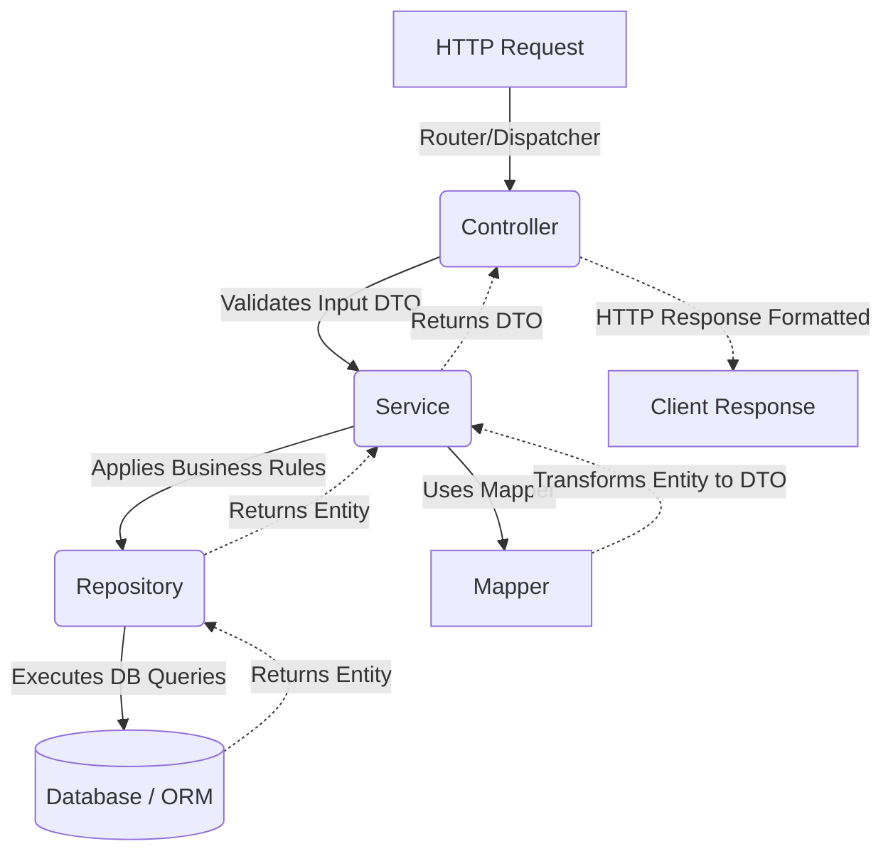

# Modular Backend Architecture Skill

> A professional standard for structuring robust, scalable, and maintainable backend applications using **Domain-Driven Modular Architecture** (also known as Vertical Slice Architecture).

This standard is framework-agnostic and applies to major backend ecosystems including **Spring Boot, NestJS, .NET (C#), Python (FastAPI/Django), and Express/Node.js**.

---

## Core Principles

Instead of grouping code by horizontal technical layers (e.g., placing all controllers in one folder, all services in another), this architecture organizes code by **domain modules or features**. 

Each module is self-contained and holds all the necessary layers for its specific functionality, achieving **High Cohesion** and **Low Coupling**. This ensures that features can be developed, tested, and modified independently.

---

## Global Project Structure

At the root level, the project separates global configuration, entry points, and cross-cutting concerns from the core domain modules.

```text
src/
 └── main/
      └── [root_package_or_main_directory]/
           ├── Application.java / main.ts    # Application Entry Point & Bootstrapper
           ├── config/                       # Global configurations (DB, Security, Server)
           ├── exceptions/                   # Global error handling and custom exceptions
           ├── utils/                        # Cross-cutting utilities (e.g., Dates, Crypto)
           ├── products/                     # Domain Module
           ├── users/                        # Domain Module
           └── orders/                       # Domain Module
```

### Component Scanning & Dependency Injection
The **Entry Point** must be located at the **root package**. This ensures the framework's Dependency Injection (DI) system can automatically, recursively scan, detect, and register all components located within the domain sub-packages without manual configuration overhead.

---

## Module Internal Structure (MVCS)

Every domain module strictly follows a layered architecture to separate concerns:

```text
feature-module/
    ├── controllers/   # Entry points for incoming requests (REST API, GraphQL)
    ├── services/      # Core business logic and use cases
    ├── repositories/  # Data access layer (Interfaces and DAO implementations)
    ├── entities/      # Domain models / Database Entities
    ├── dtos/          # Data Transfer Objects (Request/Response validation)
    ├── mappers/       # Logic to map between Entities and DTOs
    └── utils/         # Module-specific helpers or constants
```

---

## Layer Responsibilities

| Layer | Responsibility | Rules & Data Flow |
|-------|----------------|-------------------|
| **Controllers** | Presentation Layer | Handle networking, validate incoming DTOs, delegate to Services, return DTOs. Never expose raw Entities. |
| **Services** | Business Layer | Core business rules and use cases. Orchestrate calls to Repositories and use Mappers. Agnostic to HTTP. |
| **Repositories**| Persistence Layer | Manage data access. Hide database/ORM complexity from the rest of the application. |
| **Entities** | Domain Layer | Represent database structures or pure domain models. Highly sensitive, must not leak to the API. |
| **DTOs & Mappers** | Data Transfer & Transformation | DTOs define strictly structured requests/responses. Mappers translate between Entities and DTOs to keep Services clean. |

---

## The Request Lifecycle

A typical incoming request follows a strict **One-Way Flow**:



---

## Inter-Module Rules & Constraints

1. **Strict Module Isolation:** 
   - Cross-module communication must happen via Services, **not Repositories**. For example, an `OrdersService` needing user data must call `UsersService`, and never inject `UsersRepository` directly. This preserves domain encapsulation and global business rules.
2. **Avoid Global Clutter:** 
   - Place truly cross-cutting code in global `utils/` or `config/`. Domain-specific utilities belong exclusively inside the module's own `utils/` folder.

---

*This architecture standard is designed to ensure maintainability, testability, and clean code principles across any backend technology stack.*
