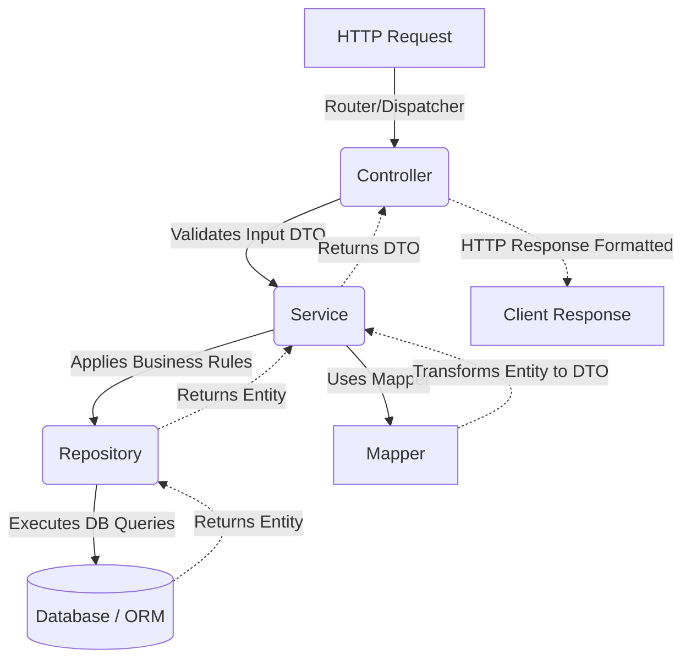

# Modular Backend Architecture Skill

> A professional standard for structuring robust, scalable, and maintainable backend applications using Domain-Driven Modular Architecture (also known as Vertical Slice Architecture).

This standard is framework-agnostic and applies to major backend ecosystems including **Spring Boot, NestJS, .NET (C#), Python (FastAPI/Django), and Express/Node.js**.

---

## Core Principles

Instead of grouping code by horizontal technical layers (e.g., placing all controllers in one folder, all services in another), this architecture organizes code by **domain modules or features**. 

Each module is self-contained and holds all the necessary layers for its specific functionality, achieving **High Cohesion** and **Low Coupling**.

---

## Global Project Structure

At the root level, the project separates global configuration, entry points, and cross-cutting concerns from the core domain modules.

```text
src/
 └── main/
      └── [root_package_or_main_directory]/
           ├── Application.java / main.ts    # Application Entry Point & Bootstrapper
           ├── config/                       # Global configurations (DB, Security, Server)
           ├── exceptions/                   # Global error handling and custom exceptions
           ├── utils/                        # Cross-cutting utilities (e.g., Dates, Crypto)
           ├── products/                     # Domain Module
           ├── users/                        # Domain Module
           └── orders/                       # Domain Module
```

### Component Scanning & Dependency Injection
The **Entry Point** (e.g., a class annotated with `@SpringBootApplication` or the root module in NestJS) must be located at the **root package**. This ensures the framework's Dependency Injection (DI) system can automatically recursively scan, detect, and register all Controllers, Services, and Repositories located within the domain sub-packages.

---

## Module Internal Structure (MVCS)

Every domain module (e.g., `products/`) strictly follows a layered architecture to separate concerns:

```text
products/
    ├── controllers/   # Entry points for incoming requests (REST API, GraphQL)
    ├── services/      # Core business logic and use cases
    ├── repositories/  # Data access layer (Interfaces and DAO implementations)
    ├── entities/      # Domain models / Database Entities
    ├── dtos/          # Data Transfer Objects (Request/Response validation)
    ├── mappers/       # Logic to map between Entities and DTOs
    └── utils/         # Module-specific helpers or constants
```

---

## Layer Responsibilities

### 1. Controllers (Presentation Layer)
- **Responsibility:** Handle networking protocols (HTTP, gRPC, WebSockets).
- **Rules:** Validate incoming requests, delegate processing to `Services`, and return appropriate HTTP responses.
- **Data Flow:** They accept `DTOs` and return `DTOs`. **Never** expose raw `Entities` directly to the client.

### 2. Services (Business Layer)
- **Responsibility:** House the core business rules, algorithms, and use cases.
- **Rules:** Must remain completely agnostic to the presentation layer (no tight coupling to HTTP Request/Response objects).
- **Data Flow:** They orchestrate calls to `Repositories` to fetch/persist data and use `Mappers` to return structured data to the Controller.

### 3. Repositories (Persistence Layer)
- **Responsibility:** Manage data access and persistence mechanisms.
- **Rules:** Hide the complexity of the database, ORM (JPA/Hibernate, TypeORM, Entity Framework), or external APIs from the rest of the application.

### 4. Entities / Models (Domain Layer)
- **Responsibility:** Represent the actual data structure in the database or the pure domain model.
- **Rules:** Highly sensitive. Must not leak out of the module through the API response.

### 5. DTOs & Mappers
- **DTOs:** Define the strict contract/structure of data entering (Create/Update requests) and leaving (Responses) the application. Perfect place for validation annotations.
- **Mappers:** Handle the translation between `Entities` and `DTOs`. This keeps the `Services` clean and focused purely on business logic rather than data transformation boilerplate.

---

## The Request Lifecycle

A typical incoming request follows a strict **One-Way Flow**:



---

## Inter-Module Rules & Constraints

1. **Strict Module Isolation:** 
   - If the `Orders` module needs data from the `Products` module, the `OrdersService` **must NOT inject the `ProductsRepository`**.
   - **Correct Approach:** The `OrdersService` must communicate via the `ProductsService` (or a dedicated public interface). This guarantees that the business rules and validations of the `Products` module are always respected.
2. **Avoid Global Clutter:** 
   - Only place truly cross-cutting code in the global `utils/` or `config/` folders. Module-specific utilities belong inside the module's own `utils/` directory.

---

## Instructions for Antigravity

When you are instructed to build, refactor, or plan a backend project using this Skill, follow these rules stringently:

1. **Analyze the Root Package:** When scaffolding or updating a project, verify or construct the root directory to hold the application's entry point (`Main.java`, `main.ts`, etc.) alongside global configurations (`config/`, `exceptions/`, `utils/`).
2. **Enforce Domain Grouping:** Create new features by adding a new top-level folder representing the domain context (e.g., `inventory/`, `users/`). **Do not** group code by global technical layers (no global `controllers/` folder).
3. **Internal Layer Scaffolding:** For every new domain module, you must create its specific subdirectory structure internally: `controllers/`, `services/`, `repositories/`, `entities/`, `dtos/`, and `mappers/`.
4. **Enforce Boundary Integrity:**
   - Always ensure Controllers receive and return ONLY DTOs.
   - Inject dependencies through constructors.
   - If User Module needs Orders data, inject `OrdersService` into `UsersService`. **Never** inject `OrdersRepository` into `UsersService` to preserve encapsulation.
